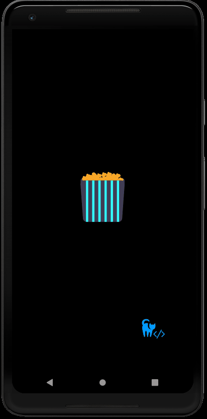

<h1 align="center">🍿 Cinemapp 🍿</h1>

<br />
<p align="center" style="text-align: center;">
   🎥 Hey, there is the Cinemapp, here you can search to you favorite movies of all times! 🎥
</p>

<p align="center" style="text-align: center;">
    Also, to develop this application, i've used the <a href="http://www.omdbapi.com/">omdbapi</a>!
</p>

<br />
  <strong>
  <p align="center" style="text-align: center;">
  🎉 This project is developed using Typescript and Expo 🎉
  </p>
</strong>

<br />

  <p align="center" style="text-align: center; font-size: 25px">
  ✨  How looks like ✨
  </p>

<p align="center" style="text-align: center;">
        
</p>

<br />


<h1></h1>
<br />


You can init this application too! Clone the project and you can start by:

```bash
cd dev-cinemapp <- get inside the main folder
yarn <- to fetch the packages
yarn start  <- start expo
```


